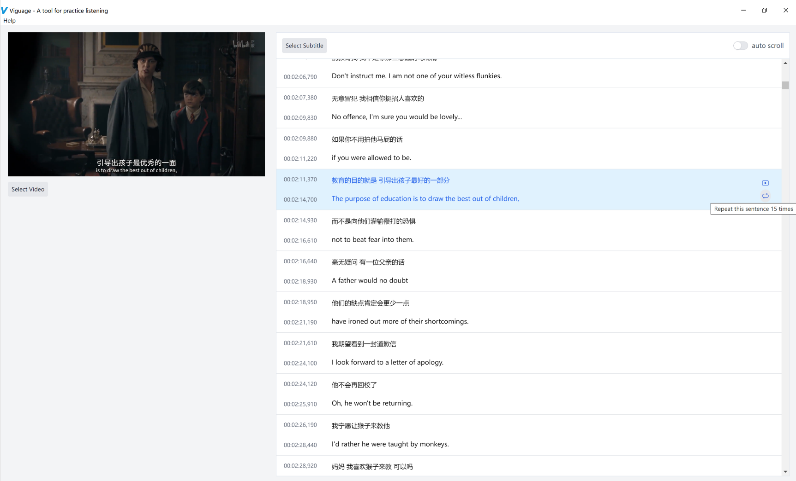

<p>
  This is an application designed for foreign language learners, allowing them to easily repeat sentences to practice and enhance their listening skills, uses <a href="https://github.com/electron-react-boilerplate/electron-react-boilerplate">Electron React Boilerplate</a>, <a href="https://tailwindcss.com/">tailwindcss</a>, <a href="https://github.com/gsantiago/subtitle.js">subtitle.js</a>, <a href="https://redux.js.org/">Redux</a> and <a href="https://videojs.com/">Videojs</a>.
</p>



## Install

Clone the repo and install dependencies:

```bash
npm install
```

## Starting Development

Start the app in the `dev` environment:

```bash
npm start
```

Build tailwind in realtime when you development:
```bash
npm run dev:css
```

## Packaging for Production

To package apps for the local platform:

```bash
npm run package
```